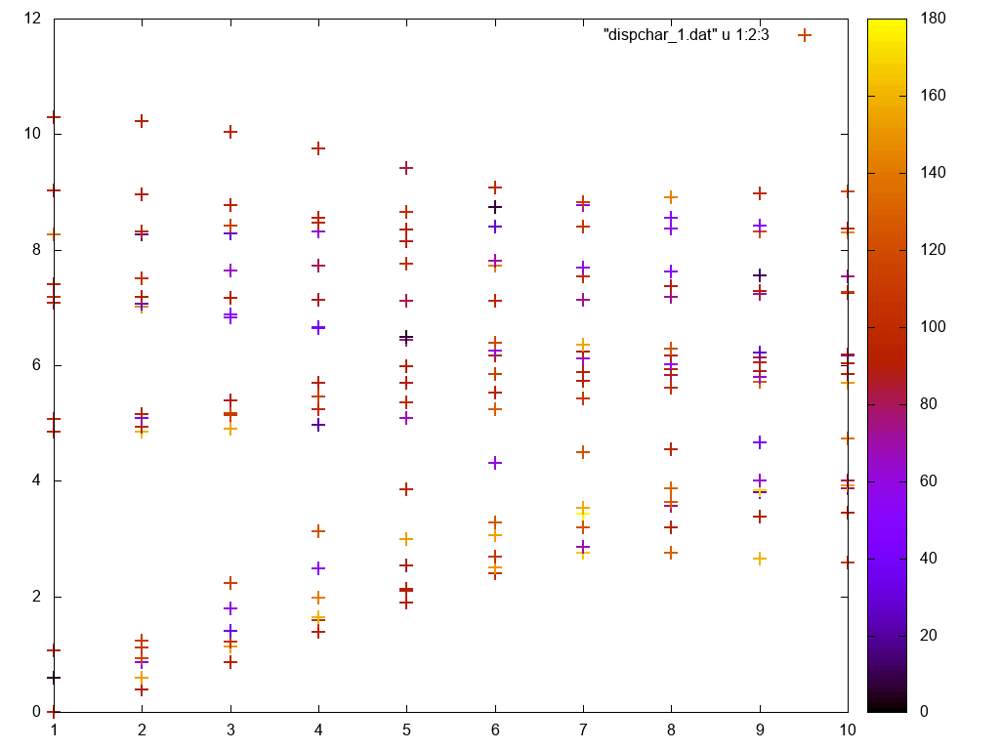

# phonchar

Program to calculate the atomic character of phonon eigenvectors obtained from the [PHONOPY](https://phonopy.github.io/phonopy) code.

## Installation

The code requires a fortran compiler. After cloning, enter the folder and compile it with

`make`

If the compilation ends successfully, the executable phonchar is created.

## Usage

The band.yaml or qpoints.yaml file must contain the eigenvectors; this can be obtained by setting

`EIGENVECTORS = .TRUE.`

in the PHONOPY configuration file.

The syntax of the input file is (remove blank lines between blocks)

```

int int int             1 or 0, flag to specify the character to calculate:
                        eigenvalues, direction, displacement.
char [char]             yaml file [POSCAR]: if yaml file is of kind qpoints.yaml
                        the corresponding POSCAR geometry must be provided
real real real          Cartesian (not crystallographic!) drift vector components
real real real          rotation axis
real real real          starting angle, final angle, step
                        if starting angle = final angle, no scan is performed
int                     number of atomic groups
int                     number of atoms in group 1
int                     label of the first atom in the group
...
int                     label of the last atom in the group
int                     number of atoms in group 2
int                     label of the first atom in the group
...
int                     label of the last atom in the group
...                     number of atoms in group 3 - if any, and similar
                        input structure as above

```

where `int`, `char` and `real` specify the type of expected input. The syntax can be shown by using the `-h` option:

```

$ ./phonchar -h
         _                      _
   _ __ | |__   ___  _ __   ___| |__   __ _ _ __
  | '_ \| '_ \ / _ \| '_ \ / __| '_ \ / _` | '__|
  | |_) | | | | (_) | | | | (__| | | | (_| | |
  | .__/|_| |_|\___/|_| |_|\___|_| |_|\__,_|_|
  |_|
                  2.3

 Running on 8 OpenMP threads
 Syntax: phonchar <setting file>

```

After the execution, the following files are created:

1) eigchar.dat: the weight is the square modulus of the eigenvector atom component eig_i(k,j).eig_i(k,j)*
2) dirchar_l.dat: the weight is the angle between the input direction and the displacement u(l,k,j,:) of the center mass of group l in mode (k,j)
3) dirchar_l_maxproj.dat: the weight is the angle between the center mass displacement u and the rotated direction which maximises the scalar product dir.u
4) dirchar_l1_l2.dat: the weight is the angle in the scalar product u(l1,k,j,:).u(l2,k,j,:) among all the possible group couples (l1,l2)
5) dispchar.dat: the weight is the atom contribution to unitary phonon displacement u_i = m_i^(-1/2) exp(ik.r) eig_i(k,j)

The header of each file contains full information about the content. We recommend to check the value of the scalar products, as very small values (e.g. less than 10<sup>-6</sup>) indicate that unitary displacements are very small.

## Example

The folder MoWS4 contains the necessary files to test the code. The *band.yaml* has been generated for the MoS2/WS2 bilayer structure reported in the *POSCAR* file; the *phchar.inp* file is an example of input file.

You can visualize the results by using [gnuplot](http://www.gnuplot.info/):

```

gnuplot> plot "dispchar_1.dat" u 1:2:3 w p palette lw 2 ps 2

```

The weight is rendered as a thermal map. 

If you run the example, you should get a figure like this:



## Citation

 The users of PHONCHAR have little formal obligations specified in the [GNU General Public License](http://www.gnu.org/copyleft/gpl.txt).
 However, it is common practice in the scientific literature, to acknowledge the efforts of people that have made the research possible.
 In this spirit, please cite

 A. Cammarata, T. Polcar, *Fine control of lattice thermal conductivity in low-dimensional materials*, Phys. Rev. B **103**, 035406 (2021), DOI: [10.1103/PhysRevB.103.035406](https://doi.org/10.1103/PhysRevB.103.035406)

 where the formulation used to calculate the phonon atomic character is reported in section V "Atomic character of the phonon modes" of the Supplemental Material.

